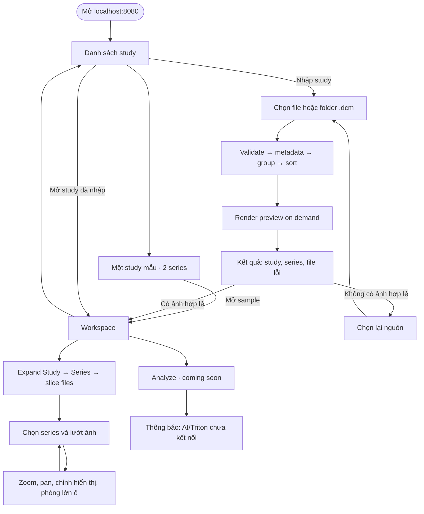

# 00 — Workflow local và màn hình cần xây

> **Cập nhật gần nhất:** 2026-10-09
> **Thay đổi gần nhất:** Giữ MPR source/orbit đã merge; review dùng temporary anonymous session thay cho demo account.
> **Thay đổi trước đó:** Tab MPR có volume intensity 3D xoay được từ cùng series; đã làm rõ MR/FS, presets và giới hạn camera/MPR.
> **Lịch sử trước đó:** Panel thông tin hiện đầy đủ Study UID; Capture có preview, preset mới là 64/128/512 px.
> **Lịch sử:** [CHANGELOG](CHANGELOG.md)

Phạm vi review hiện tại: không tài khoản hay mật khẩu; vào thẳng temporary workspace theo browser session, upload được cô lập bằng HttpOnly cookie và có thể Clear session. Upload đi qua ingest pipeline; workspace có nút **Analyze** để giữ đúng workflow tương lai, nhưng hiện chỉ hiển thị thông báo “coming soon”; chưa có model, AI panel, score hoặc endpoint inference.

## 1. User flow



Không cần upload lại examples mỗi lần vào web. Nếu nguồn mẫu chưa có, card hiện “Chưa có dữ liệu mẫu”; không báo READY. Upload progress và index progress là hai giai đoạn riêng.

## 2. Các màn hình

| Vị trí | Features |
|---|---|
| `/studies` | Một example study gồm 2 series; study đã nhập; số series/ảnh, trạng thái, Mở ảnh, Xóa |
| Dialog Nhập study | Chọn một hoặc nhiều file `.dcm`, hoặc thư mục `.dcm`; progress; kết quả/error theo file |
| `/studies/:id` | Header study, nút Analyze, sidebar cây Study → Series → slice files, tabs, viewer 4 ô, toolbar và panel thông tin |
| Panel thông tin | Loại nguồn, count, Study UID đầy đủ (tự xuống dòng) và trạng thái từng ingest stage; geometry mismatch căn trái và có giải thích |
| Xác nhận xóa | Chỉ study upload; example read-only; đang index thì chưa xóa |

Header không có Tài khoản/Đăng xuất. Nút Analyze chỉ là CTA được hiển thị trước; không được tạo score giả, AI result hoặc trạng thái “analyzed”.

## 3. Trang đầu

```text
Knee Review                                        [+ Nhập study]
Study mẫu
[Demo study · 2 series · Mở ảnh]

Study đã nhập
Tên           Series/Ảnh       Trạng thái    Mở / Xóa
DEMO-KNEE     2 / 64           Sẵn sàng      Mở ảnh
...           ...              Sẵn sàng      Mở / Xóa
```

Example label/count lấy từ backend. “Study đã nhập” có empty state riêng khi chưa upload; sample read-only vẫn hiện.

## 4. Workspace và capabilities

DICOM mở ở **Overview** gồm bốn viewport dựng từ cùng một series hợp lệ: volume MRI 3D và ba mặt phẳng axial/coronal/sagittal được tái tạo (MPR), liên kết crosshair và slice. Chọn một nguồn tại **MPR source**; đổi nguồn sẽ dựng lại cả bốn viewport cùng nhau. Mặc định ưu tiên geometry metadata hợp lệ, sau đó sagittal và số lát nhiều hơn, nhưng volume eligibility vẫn được kiểm tra riêng. Ba layout cho phép ưu tiên volume hoặc so sánh các mặt phẳng. Nếu series không đủ geometry để tạo volume, báo lý do và tiếp tục mở acquisition gốc ở các tab hướng. Tab **Sagittal**, **Coronal** hoặc **Axial** mở acquisition gốc theo hướng để đọc stack; tab **Images / Series** là browser của toàn bộ acquisition và metadata, không phải bản sao MPR. MPR không ghép các series hay sequence khác nhau.

DICOM không xác định được hướng thì mở bằng stack lớn và không ép vào SAG/COR/AX. Người dùng vẫn chọn series, lướt ảnh và zoom/pan.

| Control | DICOM |
|---|---|
| Overview MPR interaction | Chọn một nguồn ở MPR source; crosshair liên kết ba mặt phẳng; wheel/drag mặt phẳng đổi vị trí tương ứng; kéo ba vòng gizmo màu để xoay camera volume độc lập. Các tab hướng vẫn mở acquisition gốc. |
| Contrast/Brightness/Invert preview | Có trong local UI; chỉ thay CSS presentation, không sửa DICOM |
| Window width/level DICOM | Adapter đầy đủ là bước tiếp theo; không gọi preview hiện tại là calibration chẩn đoán |
| Ingest pipeline status | Panel phải hiển thị validate, metadata, grouping, sorting complete; preview on-demand |
| Hướng, FS, fluid | Có UNKNOWN và nguồn nhãn |
| Tọa độ bệnh nhân/thước mm | Chỉ khi metadata đủ; thước đo chưa thuộc P0 |
| MPR/crosshair/3D | Overview hiện có geometry gate; ba mặt MPR + MRI volume 3D xoay camera từ cùng series, không phải segmentation |
| Xóa study upload | Có xác nhận; sample read-only |

Sidebar là cây có thể expand/collapse: study → series → một vài filename đại diện và tổng số slice. Không render hàng trăm filename cùng lúc. Click tên study/series sẽ mở viewer; click caret chỉ điều khiển expand. Overview MPR luôn dùng cùng một series nguồn; các mặt phẳng thay đổi theo vị trí world trong volume, còn xoay camera 3D không đổi hướng MPR. Các tab hướng vẫn xem stack acquisition gốc. Geometry không hợp lệ thì không tạo MPR giả; dùng các tab hướng/Images / Series để xem dữ liệu gốc.

Khi mở một series lần đầu, viewer chọn lát đại diện ở giữa stack thay vì lát đầu tiên. Người dùng vẫn có thể lùi/tới từng lát bằng control Slice; đây chỉ là initial-view heuristic, không phải một lựa chọn chẩn đoán.

## 5. Ưu tiên build

L01 Docker/shell → L02 API/import DICOM + một stack → L03 sample/list → L04 workspace tree + display controls → L05 xóa/persistence → L06 restart/lỗi/QA. Analyze CTA chỉ là placeholder trong local; inference/Triton làm sau. Chi tiết step và acceptance ở [12](12-local-docker-build-steps.md), lịch hai người ở [11](11-team-rebalance-and-vibe-frontend.md).

Walkthrough nghiệm thu: mở sample study → expand cây Study/Series → chọn series nguồn ở Overview → kiểm tra volume + ba MPR lấy cùng series, thử crosshair, wheel slice, xoay volume và ba layout → vào tab hướng để đọc acquisition gốc → mở Images / Series để duyệt acquisition → nhập file/folder DICOM → bấm Analyze để kiểm tra thông báo chưa kết nối → xóa study upload → refresh → restart Docker → mở lại sample và kiểm tra seed không nhân bản.
