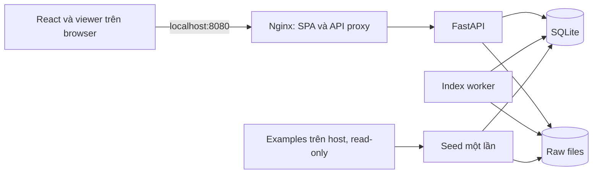

# 04 — Kiến trúc local và lưu trữ

> **Cập nhật gần nhất:** 2026-10-06  
> **Thay đổi gần nhất:** Chuẩn hóa metadata tài liệu; kiến trúc local hiện hành được giữ nguyên.  
> **Lịch sử:** [CHANGELOG](CHANGELOG.md)

Phạm vi 05/10/2026: không auth, không inference, không cloud. Docker Compose trên máy người dùng.

SQLite và raw files cùng nằm trong named volume `knee_data:/data`. Seed copy mẫu vào staging và tạo import job; worker xử lý như upload. Chỉ web publish `127.0.0.1:8080:80`, các service còn lại dùng Compose network. Browser render bằng tài nguyên local; server không cần NVIDIA GPU.

## Trách nhiệm

| Thành phần | Trách nhiệm |
|---|---|
| Web/React | List/examples, upload, sidebar, render, presentation state |
| FastAPI | Streaming receipt, validation nhẹ, catalog/manifest/files, enqueue index |
| Index worker | ZIP extraction, kiểm tra/nhóm DICOM, metadata/sort, thumbnail và commit |
| Seed | Validate source/checksum/version, copy vào staging, đăng ký job idempotent |
| Storage | Source originals immutable, DB bền vững, cache tạo lại được |

API không decode toàn study trong event loop. Worker dùng cùng Python image/codebase với API nhưng entrypoint riêng; chưa cần Redis/Celery. API chạy migration trước readiness; seed/worker chờ DB sẵn sàng. SQLite WAL, busy timeout, transaction ngắn.

## Schema tối thiểu

| Entity | Trường chính |
|---|---|
| uploads | id, kind, state, created_at, expires_at, accepted_bytes, receipts |
| import_jobs | id, upload_id, state, stage, lease_until, attempt, error |
| studies | id, source_kind=dicom, dicom_study_uid, label, source=upload/example, state, inventory_version, deleted_at nullable |
| series | id, study_id, dicom_series_uid nullable, plane/fs/fluid nullable, label_source, geometry_status, sort_method |
| assets | id, series_id, dicom_sop_uid, relative_source_path, object_key, checksum, transfer_syntax, rows/columns, frame_count |
| example_versions | example_id, version, source_checksum, state, import_job_id, study_id nullable |

App IDs là UUID. Không có principals, users, owner_id hoặc fake dev-user. Original path không lấy nguyên filename client; API lookup bằng asset ID. DICOM SOP/frame vẫn giữ provenance.

## Duplicate và commit

DICOM import lại cùng UID và checksum → reuse, báo duplicate; không tạo study mới. Cùng SOP UID khác checksum → conflict, không overwrite. Thêm asset mới vào study đã có tăng inventory_version; reader thấy snapshot inventory đã commit. Study example read-only: import khớp trả existing; bổ sung/thay đổi dưới cùng UID vào example báo conflict, không sửa mẫu qua upload.

Mỗi file phải được validate bằng header/pixel parser; extension `.dcm` chỉ là bộ lọc đầu vào, không phải bằng chứng file hợp lệ.

Commit staging → final paths bằng atomic rename cùng volume, sau đó transaction công bố inventory READY/PARTIAL. Khi crash trước DB commit, worker retry nhận diện/checksum file đã chuyển; không delete raw committed ở job khác. Dọn orphan chỉ sau khi đối chiếu DB/job và grace period, không xóa toàn staging/raw khi boot.

## Trạng thái và recovery

Upload: OPEN → CLOSED (complete được nhận) hoặc EXPIRED. Job: QUEUED → RUNNING → SUCCEEDED/PARTIAL/FAILED. Stage VALIDATING/EXTRACTING/INDEXING/COMMITTING; không dùng phần trăm giả.

Worker claim transaction, heartbeat/lease, retry transient tối đa một lần khi lease hết hạn. Validation/unsupported không tự retry. API restart không mất queue; worker restart không để RUNNING mãi. UI poll theo upload/job ID.

## Storage lifecycle và restore

Examples host mount chỉ đọc; DB/raw runtime trong Docker volume tránh SQLite chạy trên folder OneDrive. Source examples giữ để seed lại; study upload giữ đến khi người dùng xóa. Staging chưa hoàn tất/lỗi hết hạn 24h, loại trừ job active. Xóa study upload dùng `DELETING` → dọn asset files → xóa rows, ngăn reader/job mới; sample trả `EXAMPLE_READ_ONLY`. Nếu cleanup lỗi, hiện `DELETE_FAILED` và cho retry an toàn, không xóa nhầm study khác.

Backup local: dừng nhận import, chờ worker idle và dừng writer; snapshot nhất quán DB + raw files, hoặc SQLite backup API phối hợp inventory frozen. Thử restore vào volume riêng, kiểm tra count/checksum/mở ảnh. `docker compose down` giữ volume; `down -v` xóa volume. Chi tiết cấu trúc [13](13-input-formats-and-example-studies.md).

## Sau này nối AI

Thêm model repository, preprocessing và Triton client khi bắt đầu phase AI; không cần xây endpoints/model tables/panel trước. Giữ originals + metadata + inventory_version hiện tại để hỗ trợ snapshot đầu vào về sau.
