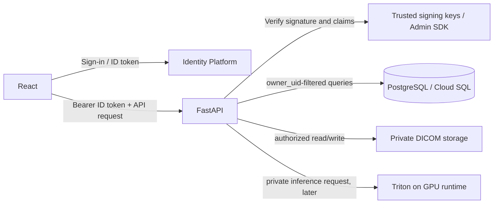

# 18 — Authentication, account ownership và dữ liệu người dùng

> **Cập nhật gần nhất:** 2026-10-09
> **Thay đổi gần nhất:** Ghi rõ trạng thái staging/production, yêu cầu reviewer có URL và chính sách demo credential/password đơn giản nhưng không dùng mật khẩu mặc định yếu trên Internet.
> **Lịch sử:** [CHANGELOG](CHANGELOG.md)

## Quyết định đề xuất

Nếu mở service cho nhiều bác sĩ/người dùng và cần study tồn tại sau khi đóng trang, hãy thêm tài khoản trước khi mời người dùng thật. Dùng **Google Identity Platform với email/password** (hoặc Firebase Authentication nếu sau này chọn hệ Firebase) để quản lý credential, đăng nhập, reset password và token. **Không tự lưu password trong PostgreSQL.** FastAPI xác minh ID token ở mọi API riêng tư; database chỉ lưu hồ sơ/role tối thiểu và quan hệ sở hữu study.

Tạo tài khoản nên là **invite/admin-provisioned**, không bật đăng ký công khai ở giai đoạn đầu. Mật khẩu là credential, không phải authorization: mỗi API vẫn phải xác minh user được phép đọc/xóa resource cụ thể.

## Account bootstrap, per-user studies và quy tắc mật khẩu

Credential khởi tạo được yêu cầu cho demo/staging: username hiển thị `admin123`, password `123456`. Tài khoản này được phép upload/delete study **của UID đó**, nhưng không có quyền vượt ownership hoặc quản trị toàn hệ thống. Example study là shared read-only. Không để người dùng xóa example.

**Mỗi người phải có Identity UID riêng** để dữ liệu thực sự riêng: upload tạo study có `owner_uid` lấy từ ID token; list/get/preview/raw-DICOM/delete chỉ query theo UID đã xác minh. Nếu nhiều người cùng dùng `admin123 / 123456`, họ là cùng một principal và thấy/có thể xóa cùng các study của account đó. Vì vậy credential bootstrap dùng để thiết lập/kiểm tra, không nên phát tán như shared login cho nhóm; provision account riêng qua invite. Nếu cần public self-sign-up sau này, phải thêm rate/abuse controls và kiểm tra isolation trước khi bật.

Identity Platform email/password yêu cầu tối thiểu 6 ký tự; `123456` được provider chấp nhận nhưng rất yếu và chỉ nên là credential tạm của staging. Không dùng cho production hoặc dữ liệu bệnh nhân; đổi/thu hồi trước khi mở production. UX không ép chữ hoa/chữ thường/số/ký tự đặc biệt và không đặt giới hạn độ dài thấp tùy tiện; tuân theo provider limits. Identity Platform hiện dùng email/password, không username-only mặc định, vì vậy `admin123` cần được map tới email account do admin provision. Không lưu password trong PostgreSQL, source, logs hoặc image. Nguồn: [Identity Platform password policy](https://docs.cloud.google.com/identity-platform/docs/password-policy?hl=en), [Sign up requirements](https://docs.cloud.google.com/identity-platform/docs/reference/rest/v1/accounts/signUp).

## Identity Platform và PostgreSQL khác nhau thế nào?

| | Identity Platform | PostgreSQL / Cloud SQL |
|---|---|---|
| Vai trò | Xác thực danh tính, quản lý credential, sign-in, reset password, ID token. | Lưu dữ liệu ứng dụng quan hệ: study, series, metadata, trạng thái ingest, quyền sở hữu, audit references. |
| Có lưu password không? | Có, do dịch vụ identity quản lý. App không đọc/lưu password thô. | Không. Lưu `identity_uid`/subject để liên kết hồ sơ, tuyệt đối không lưu password. |
| Cách backend dùng | React lấy ID token; gửi `Authorization: Bearer ...`; FastAPI xác minh chữ ký, issuer, audience, expiry rồi lấy UID tin cậy. | Query/update với điều kiện `owner_uid` lấy từ token đã xác minh, không lấy owner từ request body. |
| Có thay thế nhau không? | Không thay database nghiệp vụ. | Không phải dịch vụ đăng nhập; tự triển khai password trong DB làm tăng đáng kể rủi ro và trách nhiệm bảo mật. |

Identity Platform hỗ trợ email/password và luồng reset password. Tham khảo [Identity Platform authentication](https://docs.cloud.google.com/identity-platform/docs/concepts-authentication) và [quản lý user](https://docs.cloud.google.com/identity-platform/docs/concepts-manage-users). Với backend Firebase-compatible, client gửi ID token qua HTTPS; server dùng Admin SDK xác minh rồi lấy UID. Xem [Verify ID tokens](https://firebase.google.com/docs/auth/admin/verify-id-tokens?hl=en).

## Kiến trúc đích theo giai đoạn

MVP có thể tiếp tục dùng SQLite trên một VM khi thêm `owner_uid` và authorization, để giảm số thay đổi cùng lúc. Trước khi chạy nhiều API replicas hoặc cần quản trị DB/backup tốt hơn, migrate PostgreSQL/Cloud SQL. File DICOM ở phase cloud nên tách khỏi disk VM sang private Cloud Storage; PostgreSQL lưu object key và metadata, không chứa byte DICOM.

Mỗi upload tạo `study_id` riêng, liên kết với `owner_uid`. Series/assets kế thừa quyền từ study. List/get/preview/raw-DICOM/delete đều phải kiểm tra ownership ở server. Không dùng folder prefix đơn thuần như cơ chế bảo mật; nếu dùng GCS, backend cấp quyền/object access sau khi đã authorize. Example study là dữ liệu dùng chung read-only, không có owner cá nhân.

## Thứ tự triển khai

### P0 — Chốt threat boundary trước khi bật login

1. Staging v0 hiện chỉ qua IAP; khi tạo URL review mới, chỉ dùng sample/de-identified data, invite reviewer và bật auth/ownership trước khi cho upload.
2. Quyết định ai được cấp tài khoản, role ban đầu (`clinician`, `admin` nếu cần), email xác minh và quy trình thu hồi tài khoản.
3. Đặt upload size/quota, retention/TTL cho upload lỗi, backup, delete, audit và incident contact. Không ghi patient name, DICOM payload hoặc token vào logs.

### P1 — Identity Platform

1. Enable Identity Platform và email/password; cấu hình authorized domains, email verification, password reset, quota/billing alert.
2. Tắt public self-sign-up; chỉ admin/invite tạo người dùng. Không đặt service account key hay admin credential trong frontend.
3. React thêm sign-in/sign-out/session state và gửi ID token cho API; token chỉ lưu theo SDK/browser guidance, không tự đặt token vào URL/log.
4. FastAPI thêm dependency xác minh token bằng Admin SDK/thư viện Google được hỗ trợ; chạy trên GCP thì ưu tiên attached service account/ADC, không chép service-account JSON key lên VM/frontend. Từ chối token sai issuer/audience/expiry. CORS chỉ cho origin cần thiết.
5. Test unauthenticated `401`, token sai `401`, token hợp lệ, user A không đọc/xóa study của B (`403` hoặc `404` theo policy), admin actions và example read-only.

### P2 — Ownership và migration dữ liệu

1. Thêm user profile tối thiểu keyed by immutable Identity Platform UID; lưu display name/role nếu cần, không duplicate password/email credentials.
2. Thêm `owner_uid NOT NULL` cho study upload; backfill dữ liệu legacy theo policy rõ ràng (staging hiện có chỉ là dữ liệu demo—không tự gán cho mọi user).
3. Thêm authorization check tập trung cho toàn bộ endpoint liên quan study/series/assets; test IDOR bằng cách thay study ID.
4. Xác định quyền admin, account deletion, study retention và delete cascade an toàn; giữ example shared read-only.
5. Nếu chọn PostgreSQL, dùng migration có version, backup trước migration và thử restore; không chỉ sửa connection string SQLite.

### P3 — Cloud storage và vận hành nhiều user

1. Tạo private GCS bucket, uniform bucket-level access, public access prevention, encryption mặc định và retention/lifecycle phù hợp; backend dùng service account least privilege.
2. Upload/download qua backend có authorization; signed URL ngắn hạn chỉ phát sau khi kiểm tra owner và không log URL/token.
3. PostgreSQL lưu metadata/object key/checksum; DICOM bytes nằm ở GCS. Thêm quotas, rate limits, audit trail, metrics, backup/restore drill và cảnh báo dung lượng/chi phí.
4. Chỉ khi cần nhiều API replicas mới chuyển FastAPI sang Cloud Run/managed runtime; giữ database và storage bên ngoài instance.

## GCP hiện tại và GPU/Triton

Theo lần deploy đã kiểm tra: project `rsna-knee-511004` có một Compute Engine VM `knee-review-staging-01` tại `asia-southeast1-a`, cấu hình `e2-medium`, Debian 13, không external IPv4. Docker Compose đang chạy FastAPI + frontend cùng container trên VM qua IAP tunnel; SQLite và files ở named volume. Đây là staging demo một máy, không phải production/multi-user deployment.

VM hiện tại **không có GPU**. GPU là resource tính phí riêng, chỉ có ở các machine family/zone/quota phù hợp. Có thể sửa một số VM bằng cách stop rồi đổi cấu hình/gắn accelerator, nhưng không nên giả định `e2-medium` chỉ cần bật checkbox; shared-core machine phải đổi machine type và khả năng GPU còn tùy loại VM/zone. Kiểm tra GPU availability, quota và giá trước khi tạo. Tham khảo [Add/remove GPUs](https://docs.cloud.google.com/compute/docs/gpus/add-remove-gpus), [GPU machine types](https://docs.cloud.google.com/compute/docs/gpus) và [GPU pricing](https://cloud.google.com/products/compute/gpus-pricing?hl=en).

Khi model sẵn sàng, lựa chọn dễ kiểm soát là tạo **GPU VM riêng** chạy Triton bằng container, để app/API CPU staging gọi Triton qua mạng private. Điều này tách chi phí GPU khỏi viewer và tránh GPU chạy khi không inference. Prototype nhỏ có thể colocate FastAPI/Triton trên GPU VM nhưng toàn bộ VM GPU vẫn tính tiền khi chạy; phải giới hạn thời gian bật/tắt. Chưa cần GPU/Triton/Kubernetes cho viewer hiện tại. GKE chỉ xét sau khi cần điều phối nhiều GPU/replicas.

## Chia việc cho hai người

| Người | Phạm vi chính | Kết quả cần review |
|---|---|---|
| A — Backend/GCP | Token verification, authorization dependency, `owner_uid`, migrations/tests, storage lifecycle và GCP IAM. | API tests cross-user/unauth, migration/backup notes, least-privilege review. |
| B — Frontend/Product | Login/logout/invite UX, session expiry, protected routes, empty states, example visibility; docs/screens. | UX test, token handling review, không lộ study khi đổi account. |
| Cùng làm | Threat model, acceptance test, staging rollout và rollback. | Checklist ký xác nhận trước mời người dùng. |

Ước lượng tuần đầu: P0 + Identity Platform dev wiring + authenticated API skeleton. Tuần hai: ownership cho toàn bộ routes, tests, SQLite migration trên staging và manual security acceptance. GCS/PostgreSQL production hardening là phase riêng nếu thời gian/chi phí không đủ; không đánh đổi ownership test để kịp demo.

## Acceptance gate trước khi mở cho người khác

- API private routes không thể gọi anonymous; token invalid/expired bị từ chối.
- User A không list/get/read raw DICOM/delete study của User B, kể cả sửa URL/ID.
- User A không xóa example; study không bị gán nhầm owner sau restart/migration.
- Mật khẩu không nằm trong DB/log/source/image; token/secret không xuất hiện trong logs hoặc URL.
- Có quy trình tạo/disable account, reset credential, xóa/export dữ liệu theo policy, backup và thử restore.
- Upload limits, retention, encryption, audit, monitoring và người chịu trách nhiệm sự cố đã được xác nhận.
- Chỉ dùng dữ liệu đã được phép/de-identify phù hợp; prototype này không tự động trở thành thiết bị y tế hay hệ thống clinical-ready.
